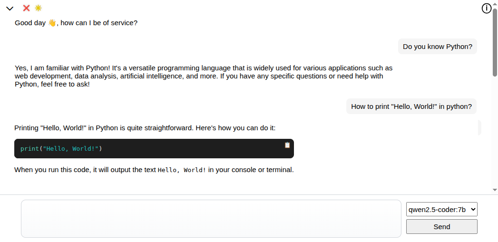

# ollama-web

An extremely basic but functional web interface for Ollama, running in a single docker container.



ollama-web relies on:
* [jquery](https://jquery.com)
* [markedjs](https://github.com/markedjs/marked)
* [highlightjs](https://github.com/highlightjs/highlight.js)

### Setup

Build:

```bash
git clone https://github.com/JCQ81/ollama-web.git
cd ollama-web
docker build -t ollama-web .
```

Create volume:

```bash
docker volume create ollama-web
```

### Run

On CPU:

```bash
docker run -d --name ollama-web -p 8088:8088 \
  -v ollama-web:/root/.ollama \
  ollama-web
```

On GPU:

```bash
docker run -d --name ollama-web --gpus all -p 8088:8088 \
  -v ollama-web:/root/.ollama \
  ollama-web
```

### Models

Make sure you pull at least one model from the [ollama library](https://ollama.com/library)

For pulling a model use the ollama cli

Example:

```bash
docker exec -t ollama-web ollama pull qwen2.5-coder:7b
```
